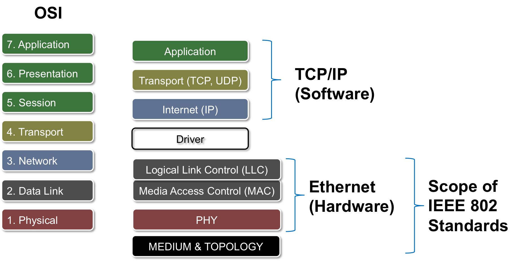
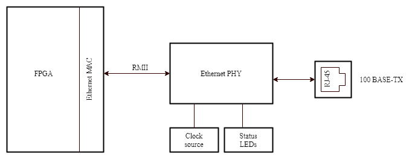

---------------------------------
Implementing the Ethernet communication protocol by utilizing the Ethernet Lite MAC IP core and the MicroBlaze microprocessor.
------------------
To replicate the project, clone the repository and execute the following commands :

#### Run on TCL console : 
````
cd [project location]
source Ethernet_script.tcl
````
*The TCL script contains a series of commands that automate the process of creating and configuring the project, adding sources, setting up constraints, generating IP cores, and building the design.*

⚠️This project is compatible with Vivado versions prior to 2019.2, as the mii2rmii IP core has been deprecated in more recent versions of Vivado.

- **Board used** : Artix  Nexys 7
## Overview on the Ethernet communication protocol 

Ethernet functions as a Link Layer Protocol situated between the physical and data link layers within the TCP/IP protocol stack. It stands out as the predominant protocol for facilitating communication within Local Area Networks (LANs).




Each device on an Ethernet network is endowed with a distinctive MAC address, enabling effective communication.

The Reduced Media-Independent Interface (RMII) is used to interface Ethernet IP core on FPGA with the Ethernet PHY chip. 

The Media Access Layer undertakes the conversion of data packets into a continuous data stream, preparing it for transmission. Subsequently, the Physical Layer (PHY) carries out the transformation of this data stream into discernible electrical signals that goes through the RJ45 connector.



